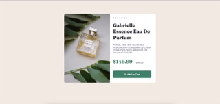

# Frontend Mentor - Product preview card component solution

This is a solution to the [Product preview card component challenge on Frontend Mentor](https://www.frontendmentor.io/challenges/product-preview-card-component-GO7UmttRfa). Frontend Mentor challenges help you improve your coding skills by building realistic projects. 

## Table of contents

- [Overview](#overview)
  - [The challenge](#the-challenge)
  - [Screenshot](#screenshot)
  - [Links](#links)
- [My process](#my-process)
  - [Built with](#built-with)
  - [What I learned](#what-i-learned)
  - [Continued development](#continued-development)
  - [Useful resources](#useful-resources)
- [Author](#author)
- [Acknowledgments](#acknowledgments)

**Note: Delete this note and update the table of contents based on what sections you keep.**

## Overview

### The challenge

Users should be able to:

- View the optimal layout depending on their device's screen size
- See hover and focus states for interactive elements

### Screenshot

### Links

- Solution URL: [Add solution URL here](https://github.com/avarvany/fem1)
- Live Site URL: [Add live site URL here](https://avarvany.github.io/fem1/)

## My process

### Built with

- Semantic HTML5 markup
- CSS custom properties
- Flexbox
- CSS Grid
- Mobile-first workflow

### What I learned

I am just proud of the fact that despite toggling with HTML and CSS for over a year, I have never really built something like this.

Today, I managed to apply a few skills I've learned and the biggest moment was when I managed to use the media queries to adopt the responsiveness; that was huge. A very large portion of this credit goes to a very silent Internet warrior, the Interneting Is Hard admin who created a wonderful HTML and CSS tutorial but for some reason has gone quiet of late; huge thanks to him.

### Continued development

This is just my first project, so of course I want to keep doing more projects to get a better understanding of CSS especially, because it's quite complex, especially around the flexbox area. Of course, I also want to learn and apply more attributes to get more wonderful effects.

### Useful resources

- [As mentioned](https://www.internetingishard.com) - This helped me understand in depth the principles of CSS especially, not to forget semantic HTML.
- [The start of my journey](https://www.theodinproject.com) - This is an amazing website that offers novices the opportunity to learn to code, FOR FREE. Big up, guys.

## Author

- Website - [Abdul Varvany](https://github.com/avarvany)
- Frontend Mentor - [@avarvany](https://www.frontendmentor.io/profile/avarvany)
- Twitter - [@yourusername](https://www.twitter.com/avarvany)

## Acknowledgments

Interneting Is Hard
The Odin Project
